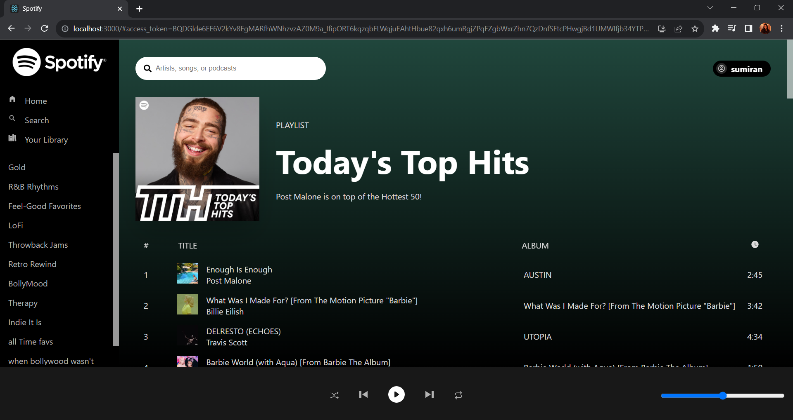
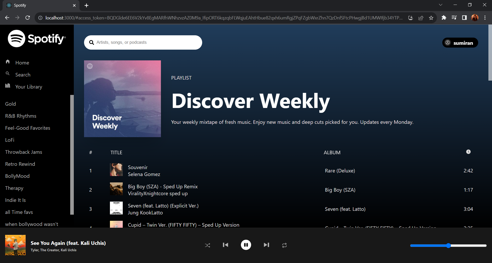
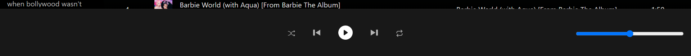
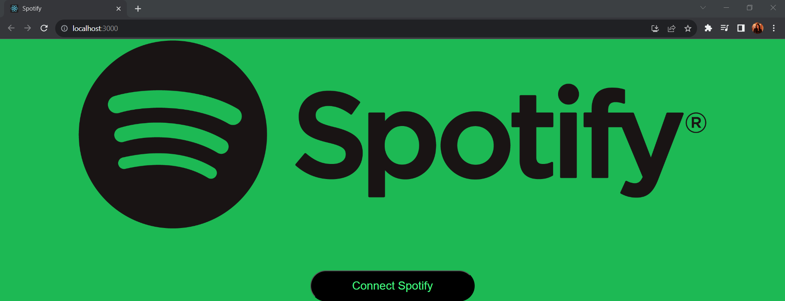
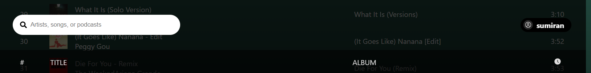
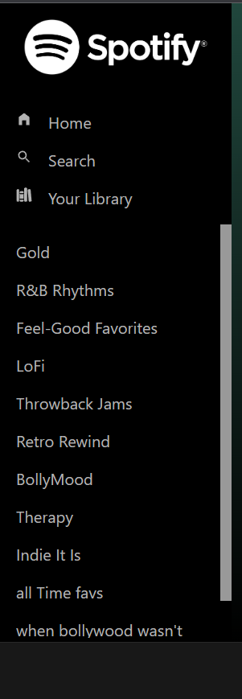

# SpotiClone
This repository contains a Spotify clone built using React.js, which aims to replicate some of the core functionalities of the popular music streaming service, Spotify. 
It allows users to log in to their Spotify accounts and access their playlists. The application utilizes the Spotify API and requires a valid client ID obtained from the Spotify for Developers website for authentication. The project also uses Axios to handle API requests and Styled Components to style the UI.



## Table of Contents

- [Features](#features)
- [Technologies Used](#technologies-used)
- [Installation](#installation)
- [Usage](#usage)
- [API Authentication](#api-authentication)
- [Folder Structure](#folder-structure)

## Features

- User authentication with Spotify using a valid `client ID`.
- Displaying user playlists and playlist details
- Playback controls for playing, pausing, skipping, etc.
- Volume control for audio playback

## Technologies Used

- React.js
- Axios
- Styled Components

## Installation

1. Clone the repository:

```
git clone https://github.com/your-username/spotify-clone.git
```

2. Navigate to the project directory:
```
cd spotify-clone
```
3. Install dependencies:
```
npm install
```
## Usage

1. Obtain a Spotify client ID by creating an app on the [Spotify for Developers website](https://developer.spotify.com/dashboard/applications).

2. Add the Spotify client ID to the `Login.jsx` component in the project's `components` folder.

3. Run the development server:
```npm start```
4. Open your web browser and visit <http://localhost:3000/> to access the application.

## API Authentication

To enable authentication with the Spotify API, follow these steps:
1. Create an app on the [Spotify for Developers website](https://developer.spotify.com/dashboard/applications).
2. Obtain the client ID from the app dashboard.
3. In the `Login.jsx` component, replace `clientID` with your actual Spotify client ID.

## Folder Structure

The project has the following folder structure:
- spotify-clone/
- ├── src/
- │ ├── components/
- │ │ ├── Body.jsx
- │ │ ├── CurrentTrack.jsx
- │ │ ├── Footer.jsx
- │ │ ├── Login.jsx
- │ │ ├── Navbar.jsx
- │ │ ├── PlayerControls.jsx
- │ │ ├── Playlists.jsx
- │ │ ├── Sidebar.jsx
- │ │ ├── Spotify.jsx
- │ │ └── Volume.jsx
- │ ├── utils/
- │ │ ├── Constants.js
- │ │ ├── reducer.js
- │ │ └── StateProvider.js
- │ ├── App.jsx
- │ ├── index.css
- │ └── index.js
- └── ...


`components` folder:
____________________________________________________________________________________________________________________________________________________________________________
- `Body.jsx`: represents the main content area of the Spotify clone where the playlist and current track information are displayed.





- `CurrentTrack.jsx`: displays information about the currently playing track, such as the track name, artist, and album artwork.
- `Footer.jsx`: represents the footer section of the application, containing playback controls like play/pause, skip, etc.

  



- `Login.jsx`: handles the login process for the Spotify API using the clientID  obtained from the Spotify for Developers website.
  




- `Navbar.jsx`: navigation bar for the application, providing search functionality and profile.

  



- `PlayerControls.jsx`: contains the playback controls, such as play/pause, skip, previous, etc.
- `Playlists.jsx`:  displays the user's playlists retrieved from the Spotify API.
- `Sidebar.jsx`: contains various sections like playlists, and recently played tracks.





- `Spotify.jsx`: handles the communication with the Spotify API using the clientID and other necessary authentication details.
- `Volume.jsx`:  responsible for controlling the volume of the audio playback.
____________________________________________________________________________________________________________________________________________________________________________

`utils` folder:
____________________________________________________________________________________________________________________________________________________________________________

- `Constants.js`:  contains constant values used across the application, such as API endpoints, and action types for the reducer.
- `reducer.js`: contains the reducer function that manages the state of the application using the React Context API.
- `StateProvider.js`:  sets up the state management using React Context API and the reducer.

____________________________________________________________________________________________________________________________________________________________________________
